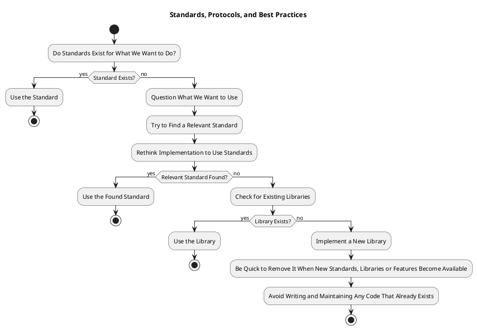

# Standards, Protocols, and Best Practices

We strictly follow existing standards, protocols, and best practices, and we define our own only if they do not exist.

We adhere to the following guidelines:

1. **Do Standards Exist for What We Want to Do?**
   - **YES**: If a standard exists, we MUST use it.
   - **NO**: 
     - We MUST question what we want to use.
     - We MUST try to find a relevant standard.
     - We SHOULD rethink the implementation to be able to use existing standards.

2. **Is There a Library That Does What We Are About to Do?**
   - If a library exists, we MUST use it.

3. **Only If All Other Options Have Been Exhausted:**
   - We MAY implement a new library, but we MUST be quick in removing it when new standards, libraries, and features become available.
   - We SHOULD NOT write and maintain any code that already exists in the form of standards or libraries.

---

## Flow Diagram

Here’s the PlanUML flow diagram based on the above guidelines:

---

## Standards Documentation Links

# Voitto  
- [Voitto Standards](voitto/standards.md)  

# Dooer  
- [Dooer Standards](dooer/standards.md)  

# Roboten  
- [Roboten Standards](roboten/standards.md)  

# K-Star  
- [K-Star Standards](k-star/standards.md)  

# M-Star  
- [M-Star Standards](m-star/standards.md)

---
